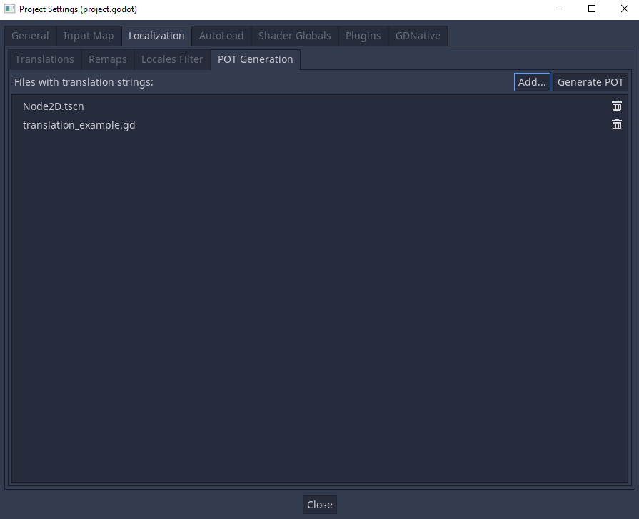
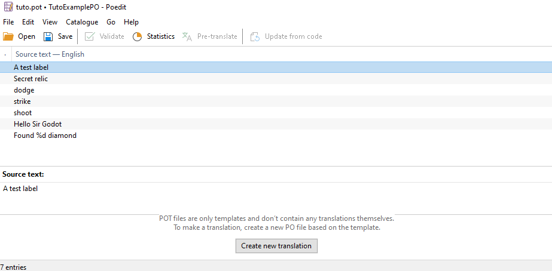
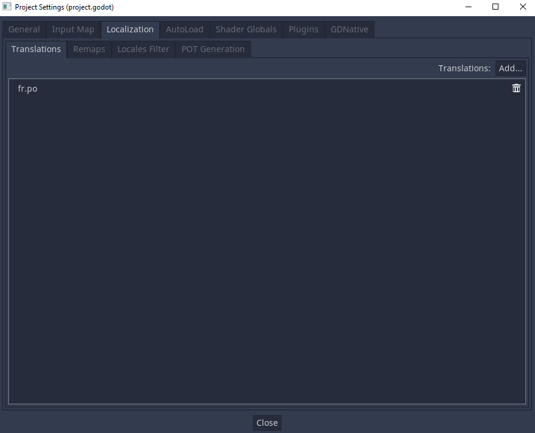
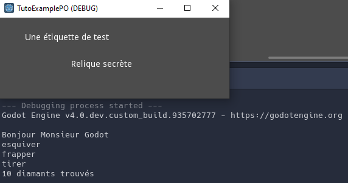

.. _doc_localization_using_gettext:

Localization using gettext (PO files)
=====================================

In addition to :ref:`doc_importing_translations` in CSV format, Godot
also supports loading translation files written in the GNU gettext
(``.po``) format.

Advantages
----------

- gettext is a standard format, which can be edited using any text editor
  or GUI editors such as `Poedit <https://poedit.net/>`_. This can be significant
  as it provides a lot of facilities for translators, such as marking outdated
  strings, finding strings that haven't been translated etc. 
- gettext supports plurals and context.
- gettext is supported by translation platforms such as
  `Transifex <https://www.transifex.com/>`_ and `Weblate <https://weblate.org/>`_,
  which makes it easier for people to collaborate to localization.
- Compared to CSV, gettext files work better with version control systems like Git,
  as each locale has its own messages file.
- Multiline strings are more convenient to edit in gettext PO files compared
  to CSV files.

Disadvantages
-------------

- gettext PO files have a more complex format than CSV and can be harder to grasp for
  people new to software localization.
- gettext PO files usually use English as the base language. Translators will use 
  this base language to translate to other languages. You could still user other 
  languages as the base language, but this is not common.

Getting started with translation using PO files
-----------------------------------------------

In this example, we'll create a small example project to show the entire process of translation with PO files.
The whole process could be summarized as: 

1) Mark strings to translate.
2) Generate a PO template (POT).
3) Copy the template into a PO file and translate it.
4) Import the PO file into the project.

Each step is detailed below.

Setup
~~~~~

Start with an empty project. Create a ``Node2D`` and attach a ``GDScript`` on it. Add some strings in the 
``GDScript`` by creating variables or using ``print()`` statements etc. You could follow the example provided below.
After that, add some ``Label`` nodes in your 2D scene, and type in some texts in the ``Text`` property. 

::

    # translation_example.gd
    
    extends Node2D

    var abilities = ["dodge", "strike", "shoot"]

    func _ready():
        print("Hello Sir Godot")
        
        for ability in abilities:
            print(ability)
        
        print("Found %d diamond(s)" % 10)

Our goal will be to translate all the added strings into the language that we want. 

1) Mark strings to be translated
~~~~~~~~~~~~~~~~~~~~~~~~~~~~~~~~

The first step is to mark all the strings that need to be translated. Use the translation 
API :ref:`tr() <class_Object_method_tr>` or :ref:`tr_n() <class_Object_method_tr_n>` 
to mark any text that you want to translate in GDScript. ``tr()`` is used to translate 
singular word or sentence, while ``tr_n()`` is used to translate plural word or sentence.

.. note:: Scene nodes' properties containing user-facing texts, such as ``Text`` property, ``Tooltip`` property, 
          will be automatically translated. The strings contained in these properties will be passed into 
          the ``tr()`` function by the game engine when the game is run.
          
The ``translation_example.gd`` should look like this after ``tr()`` and ``tr_n()`` functions are used to mark the strings.

::

    # translation_example.gd
    
    extends Node2D

    var abilities = [tr("dodge"), tr("strike"), tr("shoot")]

    func _ready():
        print(tr("Hello Sir Godot"))
        
        for ability in abilities:
            print(ability)
        
        print(tr_n(10, "Found %d diamond", "Found %d diamonds") % 10)

2) Extract marked strings (Generate PO template)
~~~~~~~~~~~~~~~~~~~~~~~~~~~~~~~~~~~~~~~~~~~~~~~~

After marking the texts in ``GDScript`` and creating some nodes containing texts, we can now extract these strings. 
In the Editor, go to **Project**, **Project Settings...**, **Localization**, **POT generation**, include the files 
containing the texts that need to be translated.

After you have included the files, click **Generate POT** and select a location. This will generate a translation 
template (POT) file in the location you have selected. POT file contains all the source strings that 
need to be translated. You can open it with a text editor or a gettext editor, such as `Poedit <https://poedit.net/>`_.

If you open it with a text editor, you'll see that the ``msgid`` field contains the source strings. In the next line after 
``msgid``, there is the ``msgstr`` field. ``msgstr`` will later contain the translated strings. Right now, they are 
empty because there isn't any translation yet.

3) Translate the strings (Translate PO)
~~~~~~~~~~~~~~~~~~~~~~~~~~~~~~~~~~~~~~~

POT file is just a translation template. Before translating, you'll need to convert the POT file into a ``.po`` file, 
which will contain the translation for a specific language. For example, you could have ``fr.po`` (French), ``ar.po`` (Arabic), 
``ru.po`` (Russian), etc. 

To convert a POT file to a PO file, there are two options:

- Open the POT file with a gettext editor. The editor will ask you to create a new PO file with the desired language.

- :ref:`Download gettext tools <doc_localization_using_gettext_installing_tools>`, and execute the command below in the 
  directory where the POT is located.

.. code-block:: shell

    msginit --no-translator --input=messages.pot --locale=fr

This example command will generate a PO file with the french language as the targeted translation language. 

After having a PO file, you're ready to translate. You can open it with a text editor, and fill in the ``msgstr`` fields to 
provide the translation. Alternatively, you can open it with a gettext editor and it will provide you with a nice interface to 
fill in the translations.

Here's how Poeditor looks like when you open a POT file with it.

4) Import the translations into Godot (Import PO)
~~~~~~~~~~~~~~~~~~~~~~~~~~~~~~~~~~~~~~~~~~~~~~~~~

After you have finished translating the PO file, you can now import them into Godot.

First, copy-paste or drag-and-drop the PO file into your Godot project folder. Then, open
**Project**, **Project Settings...**, **Localization**, **Translations**, click **Add…** 
and choose the PO file in the file dialog. The locale will be inferred from the
``"Language: <code>\n"`` property in the PO file.

5) Using the translations in game
~~~~~~~~~~~~~~~~~~~~~~~~~~~~~~~~~

Alright! Now you have everything you need. 

Before running the game, you have to tell the ``TranslationServer`` to use the desired language. 
To do this, you'll need to call the function :ref:`TranslationServer.set_locale() <class_TranslationServer_method_set_locale>`.

Here's the final code of ``translation_example.gd``. In the code below, the locale used is ``fr``. You should
use the locale of the PO file you imported.

::

    # translation_example.gd
    
    extends Node2D

    var abilities = [tr("dodge"), tr("strike"), tr("shoot")]

    func _ready():
        TranslationServer.set_locale("fr")      
    
        print(tr("Hello Sir Godot"))
        
        for ability in abilities:
            print(ability)
        
        print(tr_n(10, "Found %d diamond", "Found %d diamonds") % 10)

Now if you run the game, you should see your game translated to the language of your PO file.

If you're more adventurous, set up a button to click and switch languages. Godot provides real-time language switching so you 
don't have to restart the game every time. All you have to do is to call ``TranslationServer.set_locale()`` when you want to switch 
to another language.

.. note:: There is a translation `demo project <https://godotengine.org/asset-library/asset/134>`__ that might be worth checking out. 
          It uses CSV format as the translation files but the idea is quite the same. It also shows how to change assets (images, audio etc.) 
          according to locale, which can be very useful. 

Updating PO files
-----------------

Some time or later, you'll add new content to our game, and there will be new strings that need to be translated. When this happens, you'll
need to update the existing PO files to include the new strings.

First, generate a new POT file containing all the existing strings plus the newly added strings. After that, merge the existing 
PO files with the new POT file. There are two ways to do this:

- Use a gettext editor, and it should have an option to update a PO file from a POT file.

- Use the gettext ``msgmerge`` tool:

.. code-block:: shell

    # The order matters: specify the message file *then* the PO template!
    msgmerge --update --backup=none fr.po messages.pot

If you want to keep a backup of the original message file (which would be saved as ``fr.po~`` in this example), 
remove the ``--backup=none`` argument.

Translation workflow
--------------------

Normally, the game developers would not be the one translating their game. They will generate the POT, and 
send to a translation team or company to do the translation for them. After that, when they update the game, they will 
generate a new POT, and send the existing translated PO files and the new POT to the translation company again. 
The translation company will then fill in the new translations and the devs will have the updated PO files.

However, nothing prevents the game developers from translating the game themselves if they have a team member 
proficient with the targeted translation language.

More on Translation API
-----------------------

In the above tutorial we use :ref:`tr() <class_Object_method_tr>` or :ref:`tr_n() <class_Object_method_tr_n>` 
without using the ``context`` parameter. ``context`` could be used to differentiate the situation where a translation
is used, or to differentiate polysemic words (words with multiple meanings).

For example: 

::

    tr("Start", "Main Menu")
    tr("End", "Main Menu")
    tr("Shop", "Main Menu")
    tr("Shop", "In Game")

In the above tutorial, we use ``%`` to insert the quantity when translating plurals:

::

    tr_n(10, "Found %d diamond", "Found %d diamonds") % 10

For more control over the format of the string, you could use the :ref:`String.format() <class_String_method_format>` function:

::

    tr_n(10, "Found one diamond.", "Found {num} diamonds.").format([10], "{num}")

Strings extraction in POT generation
------------------------------------

The POT generation works by parsing and extracting strings from relevant function APIs, 
assignments and node properties, from included ``GDScript`` and scene files.

For scenes files, extracted properties are ``Text``, ``Hint_Tooltip``, ``Placeholder_Text``, ``Dialog_Text``, 
``Filters``, and ``built-in GDScript``.

In ``GDScript``, the extracted APIs and assignments are listed below. We'll define ``____`` as the strings 
that will be extracted.

.. note:: For the strings to be extracted, the arguments must be in string literals form. In other words, string contained
          in a variable will not be extracted. For example, ``tr(var_reply)``, the strings contained in ``var_reply`` will not
          be extracted.

Commonly used APIs:

::

	tr("____", "____") # Second argument ``context`` is optional.
	tr_n(n, "____", "____", "____") # Fourth argument ``context`` is optional.
	get_node("SomeNode").text = "____"
	get_node("SomeNode").set_text("____")
	get_node("SomeNode").hint_tooltip = "____"
	get_node("SomeNode").set_tooltip("____")
	get_node("LineEdit").placeholder_text = "____"
	get_node("LineEdit").set_placeholder("____")

Less commonly used APIs:

::

	# First argument is extracted.
	get_node("PopupMenu").add_check_item("____",)
	get_node("PopupMenu").add_item("____",)
	get_node("PopupMenu").add_multistate_item("____",)
	get_node("PopupMenu").add_radio_check_item("____",)
	get_node("PopupMenu").add_separator("____")
	get_node("PopupMenu").add_submenu_item("____",)
	get_node("Tabs").add_tab("____",)

	# Second argument is extracted.
	get_node("PopupMenu").add_icon_check_item(,"____",)
	get_node("PopupMenu").add_icon_item(,"____",)
	get_node("PopupMenu").add_icon_radio_check_item(,"____",)
	get_node("PopupMenu").set_item_text(,"____",)
	get_node("Tabs").set_tab_title(,"____")

	# Name of extension is extracted.
	get_node("FileDialog").add_filter(", ____")
	get_node("FileDialog").set_filters(PackedStringArray([", ____"]))
	get_node("FileDialog").filters = PackedStringArray([", ____"])

POT generation custom plugin
----------------------------

If you have any extra file format to deal with, you could write a custom plugin to parse and and extract the strings from the custom file. 
This custom plugin will extract the strings and write into the POT file when you hit **Generate POT**. To learn more about how to
create the translation parser plugin, see :ref:`EditorTranslationParserPlugin <class_EditorTranslationParserPlugin>`.

More on PO format and gettext
-----------------------------

If you would like to find out more about how gettext works, here's a 
`A Quick Gettext Tutorial <https://www.labri.fr/perso/fleury/posts/programming/a-quick-gettext-tutorial.html>`_.
It's written with C projects in mind, but much of the advice also applies to Godot.

For the complete documentation, see `GNU Gettext <https://www.gnu.org/software/gettext/manual/gettext.html>`_.

Checking the validity of a PO file or template
----------------------------------------------

It is possible to check whether a gettext file's syntax is valid.

If you open with Poeditor, it will display the appropriate warnings if there's some syntax errors. 
You could also verify by running the gettext command below:

.. code-block:: shell

    msgfmt fr.po --check

If there are syntax errors or warnings, they will be displayed in the console.
Otherwise, ``msgfmt`` won't output anything.

.. _doc_localization_using_gettext_installing_tools:

Installing gettext tools
------------------------

- Poedit. The gettext editor that is used above in the tutorial. `Official page <https://poedit.net/>`_.

- Command-line tools

  - **Windows:** Download an installer from
    `this page <https://mlocati.github.io/articles/gettext-iconv-windows.html>`_.
    Any architecture and binary type (shared or static) works;
    if in doubt, choose the 64-bit static installer.
  - **macOS:** Use `Homebrew <https://brew.sh/>`_ to install gettext with the
    ``brew install gettext`` command.
  - **Linux:** On most distributions, install the ``gettext`` package from
    your distribution's package manager.
