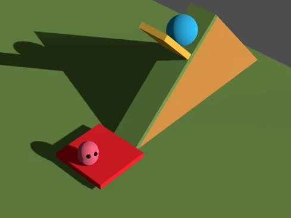

.. _doc_signals_concise_example:

Signals, concise example
========================

Goal: Rotate the **yellow gate** by sending a signal from the **red button**.

``red_button.gd``

.. tabs::
  .. code-tab:: gdscript GDScript

    extends Area3D
    signal trigger(degrees_sent : int, player_color_sent : Color)
  
    func _on_body_entered(body):
        if body == %Player
            trigger.emit(90, Color.GOLD)

  .. code-tab:: csharp

        // red_button.cs
        using Godot;

---------

``yellow_gate.gd``

.. tabs::
  .. code-tab:: gdscript GDScript

    extends StaticBody3D
    
    func _ready():
        %RedButtonArea3D.trigger.connect(_on_trigger_press)
    
    func _on_trigger_press(degrees_received, player_color_received):
        rotation.x = -deg_to_rad(degrees_received)
        %"Player/Mesh".mesh.material.albedo_color = player_color_received

  .. code-tab:: csharp

        // red_button.cs
        using Godot;

Just to reiterate:

* Signal *trigger* is **defined** in sender (red button)
* Signal *trigger* is **emitted** in sender (red button)
* Signal *trigger* is **connected** in receiver (yellow gate), but pointing to the sender object first

---------

* **degrees_sent** and **degrees_received** (first argument) don't need to have the same name and
* **player_color_sent** and **player_color_received** (second argument) don't need to have the same name.
* Just make them so that you understand what's going on.
* But make sure the arguments are in correct order in both sent or received signals:
* Like so: **signal(first_argument, second_argument)**
* You don't have to put any arguments for the signal, like so: **signal trigger**, but you must have the same amount of arguments for all of the signals of that name.
